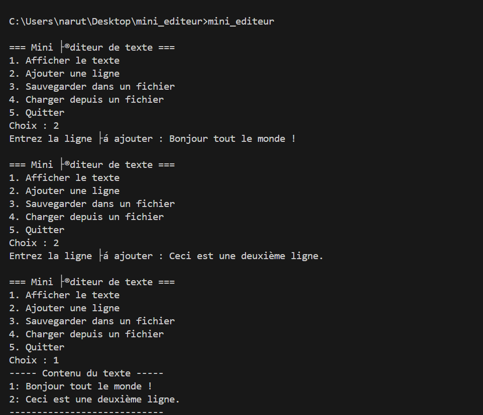

# Mini éditeur de texte en C++

Ce projet est un mini éditeur de texte en console, écrit en C++.  
Il permet d'ajouter, afficher, sauvegarder et charger du texte via un menu simple.

---

## Exemple


## Structure du projet

```
mini_editeur/
├── src/
│   ├── main.cpp
│   └── editor.cpp
├── include/
│   └── editor.h
├── Makefile
└── README.md
```

---

## Prérequis

- Compilateur C++ (g++ recommandé) supportant C++17  
- Make (optionnel, pour faciliter la compilation)

---

## Compilation

### Avec Make (recommandé)

```bash
make
```

### Sans Make (compilation manuelle)

```bash
g++ -std=c++17 -Wall -Wextra -Iinclude src/main.cpp src/editor.cpp -o mini_editeur
```

---

## Utilisation

Lance l’application compilée :

```bash
mini_editeur
```

Un menu s’affiche, avec les options suivantes :

1. Afficher le texte  
2. Ajouter une ligne  
3. Sauvegarder dans un fichier  
4. Charger depuis un fichier  
5. Quitter  

Tape le numéro correspondant et appuie sur Entrée pour interagir.

---

## Exemple

Ajouter des lignes, afficher, sauvegarder dans un fichier texte, puis quitter.

---

## Nettoyage

Pour supprimer les fichiers objets et l’exécutable (si compilé avec Make) :

```bash
make clean
```

---
## 🐳 Docker

### 1. Créer un fichier Dockerfile

Dans le dossier racine du projet (`mini_editeur/`), créez un fichier nommé `Dockerfile` avec le contenu suivant :

```Dockerfile
FROM ubuntu:22.04

RUN apt-get update && \
    apt-get install -y build-essential && \
    apt-get clean

WORKDIR /app
COPY . .

RUN g++ -std=c++17 -Wall -Wextra -Iinclude src/main.cpp src/editor.cpp -o mini_editeur

CMD ["./mini_editeur"]
```

---

### 2. Construire l’image Docker

Dans le terminal, placez-vous à la racine du projet (`mini_editeur/`) puis exécutez :

```bash
docker build -t mini-editeur .
```

---

### 3. Lancer l’application dans le container

```bash
docker run -it --rm mini-editeur
```

- `-it` : mode interactif pour afficher le menu dans le terminal
- `--rm` : supprime automatiquement le container après fermeture

---

### ✅ Résultat

Le menu de l'éditeur de texte s'affichera dans votre terminal comme en exécution locale.

---

### 💾 Sauvegarder/charger des fichiers texte (volume Docker)

Pour que les fichiers soient sauvegardés **sur votre machine**, vous pouvez monter un volume :

```bash
docker run -it --rm -v ${PWD}/data:/app/data mini-editeur
```

Dans le programme, utilisez des chemins comme :

```
data/montexte.txt
```

pour lire/écrire dans le dossier `data` qui sera **partagé avec votre système hôte**.

---

## 🧹 Nettoyer (optionnel)

Pour supprimer l’image Docker :

```bash
docker rmi mini-editeur
```

---